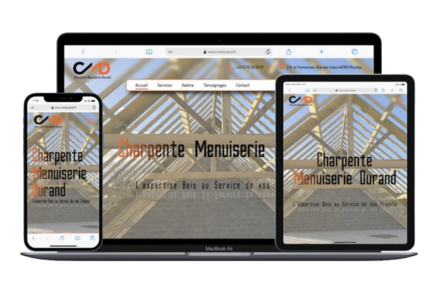

# Charpente Menuiserie Durand



Sur ce lien, vous trouverez tout le code lié au site web, au cas où.
En cas de soucis et que je ne puisse plus m'occuper du site, il faudra alors savoir ceci:

- Le site est entièrement développé en Next.js, Tailwind CSS
- Seuls des développeurs React.js/Javascript qui connaissent et ont un compte sur Github.com sauront utiliser ce code, y'en a à revendre, une petite annonce sur Linkedin et le tour est joué. Sinon sur des sites de freelance comme upwork.com, tu cherches un développeur Next.js/Tailwind CSS. Pas besoin d'un francophone non plus, tout dans le code est en anglais à par le contenu.
- Le nom de domaine est hébergé sur le compte O2switch de Melvyn pour 3 ans en date de Février 2024, voir avec lui pour les identifiants.
- Le site/code est lui hébergé sur Vercel. Les variables d'envirronement (pour le formulaire emailjs entre autre), sont stockées là-bas également, pour protéger la sécurité du site.
- Le formulaire de contact du site fonctionne grâce à emailJS. Je ne peux pas laisser les identifiants ici car ils sont personnels. En cas de soucis un jour, en modifiant le code il est assez simple de basculer le formulaire vers un autre projet/compte emailJS.

Pourquoi Vercel, et pas un cpanel sur O2Switch par exemple?

- J'ai pensé que le site étant nouveau, et qu'il ne devrait pas (au moins dans un premier temps), générer beaucoup de trafic, il n'était pas nécessaire de le faire héberger sur des serveurs privés et que la solution gratuite de Vercel était suffisante pour le moment.

### Pour les futurs développeurs travaillant sur ce site

Vous devez simplement cloner ce repo.
Ensuite, depuis votre terminal, naviguez jusqu'au dossier du projet puis faites:

```
npm install
```

Lancez l'appli avec:

```
npm run dev
```

L'app sera accessible une fois lancée sur votre serveur local (généralement localhost:3000) --> elle ne s'ouvre pas toute seule, il faut aller sur votre navigateur et vous même entrer le nom du port.

### Structure du code

Travaillant avec Next.js, j'ai choisi de développer le site sans utiliser de dossier /src. A la place, j'utilise un dossier /app dans lequel vous trouverez plusieurs dossiers, correspondant chacun à une page du site.
Tout les styles sont en défini par des classes Tailwind directement dans le .jsx, à part quelques trucs un peu plus complexes comme des gradient/animations, que j'ai placé dans le fichier global.css.
Le code commun à toutes les pages du site se trouve dans le fichier layout.js, et le code de la page principale dans le fichier page.js, situé dans le répertoire source (/app) du code.

### Contact

Des questions? Vous pouvez me contacter soit à thomas.augot@hotmail.fr ou par téléphone au +34 645 52 12 46
